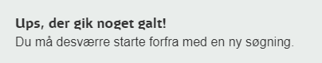

# Dsb Ticket Scanner

This application scans and visualizes ticket prices from dsb.dk (Danish train operating company).

Features include: 
- Show ticket prices for specific time intervals and destinations. A ticket contain prices for all ticket types i.e. adult, student, orange etc.
- Show ticket price development over time 
- Get notified if ticket price falls or rises

## Motivation

Getting an overview of available tickets on dsb.dk can be very cumbersome if you are flexible with the depature time/date. 
For instance, the search results only show a part of the depatures for a given day which means you have to "expand" the results multiple times. Sometimes it is even necessary to make a new search in order to show earlier/later depature times as well as show results for another date. 

Lastly, it is useful to know how ticket prices develop over time to know how many days in advance you should buy your ticket to avoid paying overprice. 

And also, this: 

## Usage

Use the low level DsbBatchClient for more control or the high level DsbTicketScanner

> TODO: 
> - INSERT EXAMPLES

## About

> TODO: 
> - Describe architecture 

## Getting Started

> TODO:
> - Notification settings (discord/mail)

## Running the application

### Installer

An .exe installer is provided in the latest release package.

### Running from source

Clone the project: 
1. `git clone https://github.com/roedebaron/dsb-ticket-scanner`
2. `cd dsb-ticket-scanner/DsbTicketScanner.Api`
3. Run `dotnet run`. This will automatically download all dependencies, build the project and then run the service. 
4. If no other port has been specified in the configuration, the service is now running on port 5000. 

## Usage 

> TODO:
> - Insert screenshot, demo gif, code examples... 

## Project TODO

- [ ] Push code to repo
- [ ] Ensure basic functionality OK + refactor old code
- [ ] Make GUI - either desktop (WPF) or web
- [ ] Implement long running process that scans ticket prices over time
- [ ] Implement notifications. Discord webhook?
- [ ] Migrate to .NET 5
